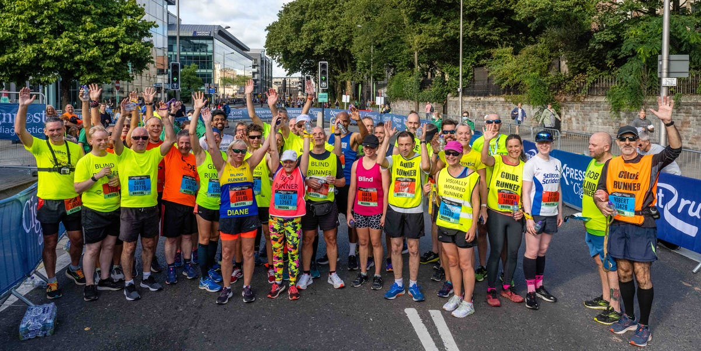

# VI Runners Bristol

[VI Runners Bristol Website](https://carlos-n21.github.io/p1-vi-runners/)  
  

Overview:
Welcome to the website of VI Runners Bristol, a community group for visually impaired runners from Bristol, UK. 
This website serves as an informative platform for existing and prospective members to learn more about our activities, benefits of running, and how to join us.

Facebook Group:
This website website is based on the active Facebook group: [VI Runners Bristol Facebook Group](https://www.facebook.com/groups/1890506954520150/)

Development Details
Coded with: Copilot AI assistance and Bootstrap libraries.

Layout: Created using Balsamiq wireframes.

  - [Wireframe File](readme-files/VI-Runners.bmpr)

  
  
  

All pages have same title, navbar and footer for consistency. Footer only has one link for Facebook as this group is not using other social networks.
These can be added in the future.

      
     
  

Fonts Used: Roboto, Oswald, sans-serif.

The idea is for the site to be accessible for visually impaired users.
The background color used was white (#FFFFFF) and the font color was black (#000000) for the main content.
This provides a high contrast ratio of 21:1 for the main content. Provided by [WebAIM](https://webaim.org/resources/contrastchecker/?fcolor=0000FF&bcolor=FFFFFF)
For the tile and heading used blue (#0000FF) with a contrast ratio 8.59:1. 

Content Source
The content on this site has been sourced from the group Facebook page, as AI was unable to generate realistic images using AI as shown below:

      

Pages Overview
1. Home
Has a hero image for the group

About us: Brief introduction to VI Runners Bristol and how the group works.

Running Benefits: Short list of overall physical and mental health benefits of running.

2. About
Links to the "About us" part on the home page.

3. Gallery
Images: A collection of images showcasing our group activities, from runs to social gatherings.

4. Location
Meeting Points: Information on where we meet, including embedded Google Maps for easy navigation.

5. Contact
Contact Form: A simple form to get in touch with us for more information or to join the group.

6. Success (hidden page)
Page create to provide feedback to the user that message was sent with link to homepage.

User stories:

[User story 1](https://github.com/Carlos-n21/p1-vi-runners/issues/1)
Story: I am a VI runner that has moved to Bristol and looking to know more about other VI runners in the area and guides to go for a run.

Acceptance criteria:
Information about the group

Tasks:
Create a home page with information about the group

[User story 2](https://github.com/Carlos-n21/p1-vi-runners/issues/2)
Story: I am a VI runner that has lived and been racing with friends in Bristol area occasionally, and would like to meet more VI runners and days they run to start run with more people

Acceptance criteria:
Information about main locations for running
Provide information about day(s) and time(s) when the group usually goes running

Tasks
Create a page/section with information about the location and time to meet

[User story 3](https://github.com/Carlos-n21/p1-vi-runners/issues/3)
User story: I am a VI runner that has been running with the group and wish to be able to have clear image and information of the site and content and to easily access different contents of it.

Acceptance criteria:
Provide alternative means of information for VI users that might have difficulty seeing the images and content of the site
Make the site interactive and responsive

Tasks
Create a Navbar with high contrast for VI users and provide a description for verbal assistance.
Showcase simple and concise information in small areas of the webpage.

[User story 4](https://github.com/Carlos-n21/p1-vi-runners/issues/4)
User story: I am a VI runner that would like to know more information about the group and also other sites/apps where they showcase the group

Acceptance criteria
Provide information about the social networks of the group
Make social information easily available on the webpage

Tasks
Create a section with information about the different social networks for the group

[User story 5](https://github.com/Carlos-n21/p1-vi-runners/issues/5)
User story: I am a VI runner and would like to be able to contact the group for more information about different activities and lifts to meetings location

Acceptance criteria:
Provide a way for the user to contact the group
Give feedback to the user that the message was sent

Tasks
Create a Contact us area in the webpage
Create a message/feedback output for the user

[User story 6](https://github.com/Carlos-n21/p1-vi-runners/issues/6)
User story: I would like to see the comments and reviews from other group members about the meetings

Acceptance criteria:
Allow users to comment on the webpage about their experiences with the group
Let members evaluate how much they enjoy the group

Tasks:
Create an area for users to write their comments
Create a section displaying different user reviews/comments

Languages used to build the webpage:
- HTML
- CSS
- Bootsrap libraries

Validator Testing:

- HTML
  - Various errors were shown during validation, related to aria-describedby to try to add more information for screen reader tools, these were not able to be changed as not enough knowledge about it and what tools can be used, searched but not found much information W3C validator
- CSS
  - No errors were found when passing through the official (Jigsaw) validator

Each page performance:

     
     

Future features:
- Add more interactivity to the site, pending accessibility evaluation and impact on visually impaired users, if meaningful
- Add comments/reviews area/page for other users to see how group members feel about it
- Search for accessibility tools to improve screen reader information for VI users
- Add other features that VI users can find usefull for them

Deployment:
- First deployment done on 12/11/2024 from the Github repository "p1-vi-runners", after creating a new environment.
[Github repository](https://github.com/Carlos-n21/p1-vi-runners)
- Further deployments done after fixing errors/bugs on deployment.

Credits
Website Development: Carlos N.

